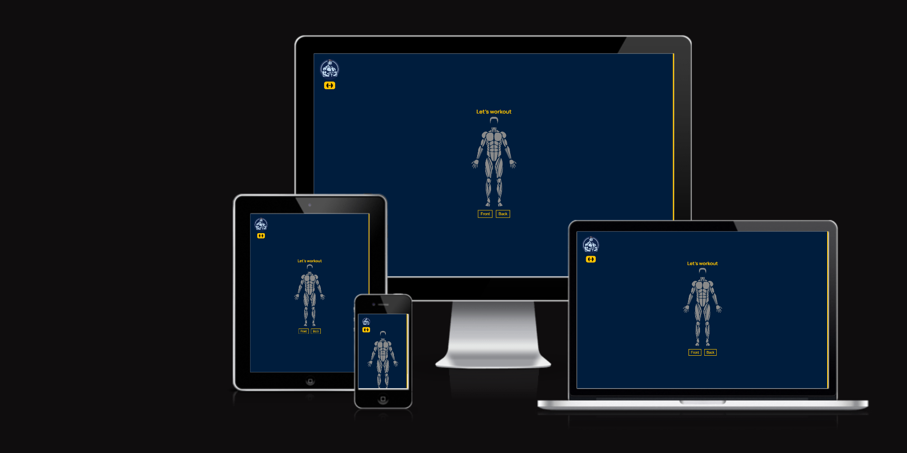

# Body Sculpting

## Javascript Essentials Milestone Project.

Welcome to **Body Sculpting**! A workout planner app meant to give it's users information about muscle groups, exercises they can practise to improve their health and plan/create a training routine.

### Existing Features

- **The human body**

  - This is the main attraction of the app where users see the muscle groups and make a decision on what they want to workout.
    
  - This section will allow users to select the muscle group and receive usefull information paired with exercise video tutorials.

- **Exercise section**

  - When users click on a mouscle group an exercise section appears.
  - It is meant to give users information and video tutorials of exercises they can do.
    

- **Adding exercise**

  - Each exercise listed in the exercise section has a button linked to it.
  - Users can press the button and add it to their exercise list.

- **Exercise notification**

  - After adding exercises users will be notified by a notification bubble.
    

- **Exercise List**

  - This section containes the selected exercises.
  - Here users can select the difficulty of the selected exercises.
  - After selecting the difficulty, new information related to the exercises will be shown.
    

- **Persistent data across user sessions**
  - Selected exercises, workout routines, and personalized settings are saved locally, ensuring that nothing is lost in the fitness progress.
  - The data remains on the device, enhancing privacy and security. No sensitive information is stored in external servers.

## Technologies used

### HTML5

- As a structure language.

### CSS3

- As style language.

### Javascript

- As a programming language.

### Font Awesome

- As an icon library for social links.

### GitHub

- As a software hosting platform to keep the project in a remote location.

### Git

- As a version-control system.

### Inkscape

- Software used to modify images and create SVGs.

## Testing

I used Mozilla web developer tools and Chrome developer tools throughout the project for testing and solving problems with responsiveness and style issues.

Website was tested across multiple virtual devices and browsers with the help of the developer tools. I checked all supported devices and all the features are behaving and showing according to the screen size.

I also tested the website on my personal hardware: Xiaomi 12 pro that runs on Android 13.

### Performance Testing

I used [Lighthouse](https://developer.chrome.com/docs/lighthouse/overview/) tool to check performance of the website and these are the results.

The biggest issues where related to performance and it was because I wasn't using an optimal format for images. As a solution I converted all of the images into **WebP**.

### Validator Testing

- W3C CSS Validator to validate CSS
- W3C validator to validate HTML

## Deployment

The project was deployed on GitHub Pages.

To deploy a the project I had to:

- In the GitHub repository, navigate to the **Settings tab**.
- From the source section drop-down menu, select the **Deploy from branch**.
- From the branch section drop-down menu, select the **main** as the branch and **/(root)** as the folder and click **save**.
- After a couple of minutes the website will be deployed and you will find at the top of the page the link to your website. **(in case you don't see anything, refresh the page)**

The live link can be found here - https://claudiu-ionel.github.io/Body-Sculpting/

## Credits

### Content

- The icons on the website were taken from [Font Awesome](https://fontawesome.com/)

- Videos on the website were embeded from these respective youtube channels:
  - **ATHLEAN-X** - [video link](https://www.youtube.com/@athleanx)
  - **Mind Pump TV** - [video link](https://www.youtube.com/@MindPumpTV)

### Media

- The images used on the website were generated by [Midjourney](https://www.midjourney.com/app/)
- Body SVG used on the website was downloaded from [Pixabay](https://pixabay.com/vectors/anatomical-anatomy-anatomy-chart-6826992/)
